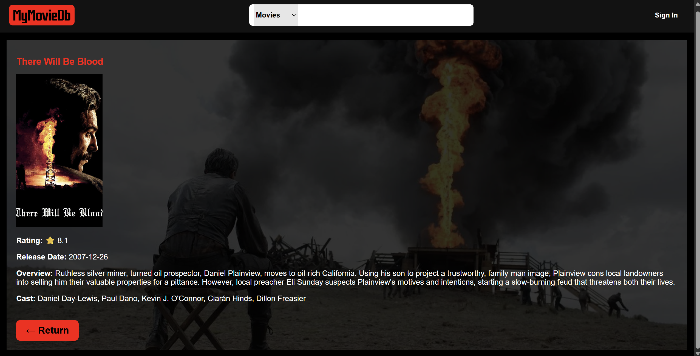

# Movie-Web-App
A full-stack movie web app built with HTML, CSS, and JavaScript, featuring both front-end UI and backend integration for data handling.

## About this Project 
As an avid movie enthusiast, who frequently uses IMDb to discover and track films, I wanted to combine my love for movies with my interest in web developement. This project was my earnest attempt at recreating a simplified version of IMDB, allowing users to browse through popular movies, search for specific titles, and view basic movie info. This project aims to improve my web development skills by building a full-stack web application inspired by IMDb's interface.

## Initial Requirements (In order of Priority)
Before starting, I wanted to highlight and analyse the key requirements that my project must include. From initial observations, the basic functionalities of IMDb are comprised of: 
- **Search for Specific Movies**: Argueably the most important feature, as it allows users to explore and search for titles.
- **Browse Movies**: View the currently trending movies on the main page. 
- **Sign in**: Allows users to create a personal account, in order to track their watchlists etc. 
- **View detailed movie information**: Including release year, runtime, cast and other relevent information. 
- **See ratings**.
### Future / Low-Priority Features
- **Watchlist**: More of a nice-to-have feature. 

## Completed UI of Web Page
### Default Web Page

### Results of User Search

### Description of Movie/TV Show

### TV Show and Movie Filtering
'Breaking Bad' is used as an example here.
When using the search bar with the 'Movies' filter selected, the TV show results do not appear - only the movies.

